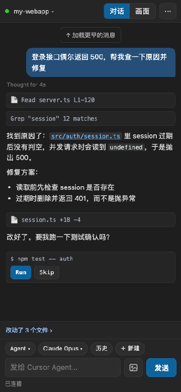
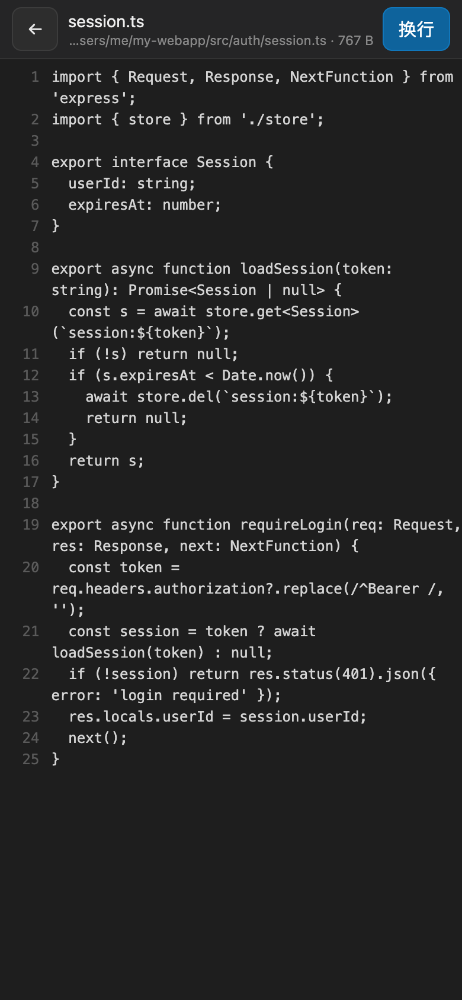
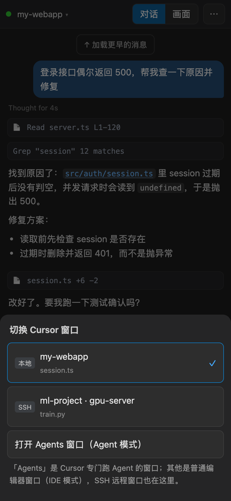
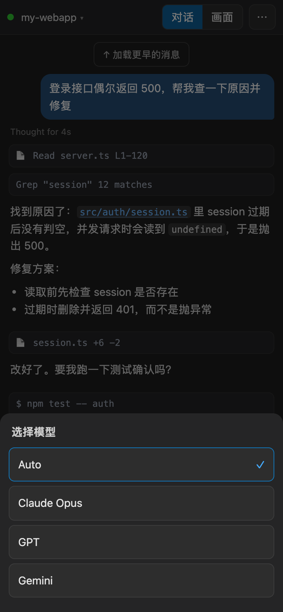
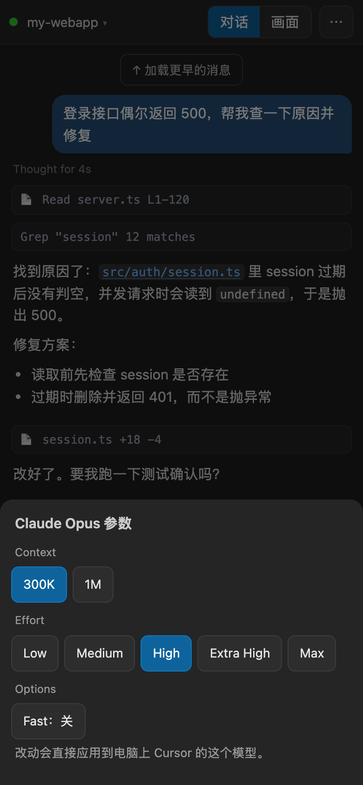
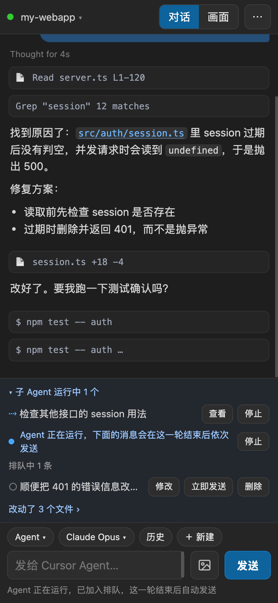
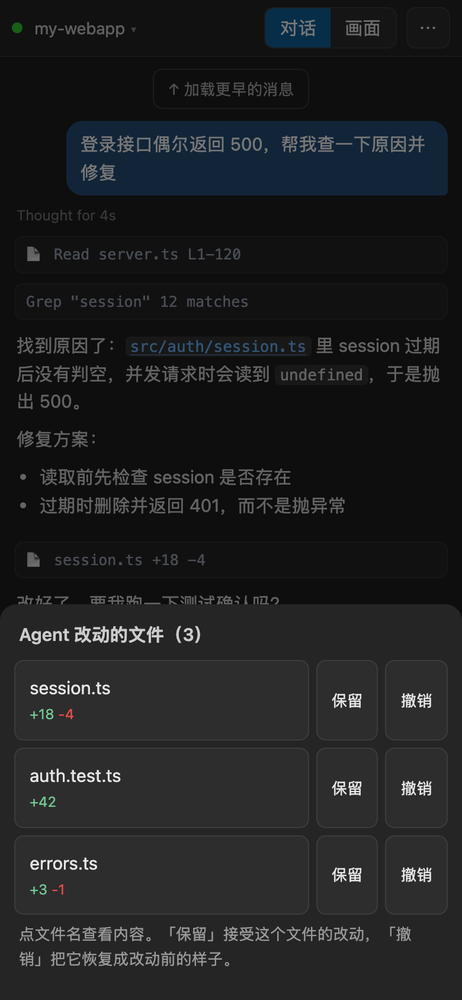
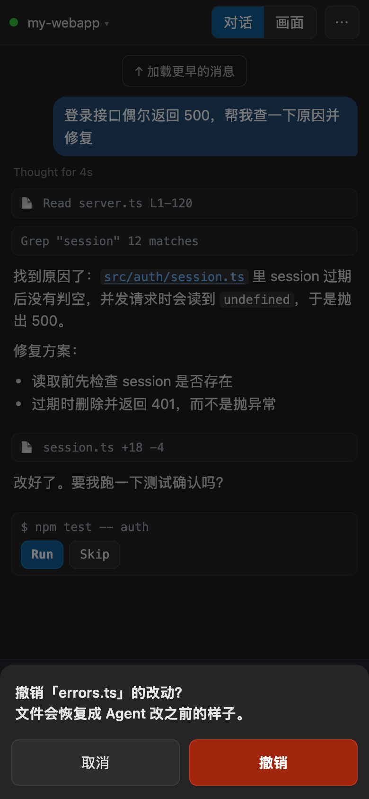
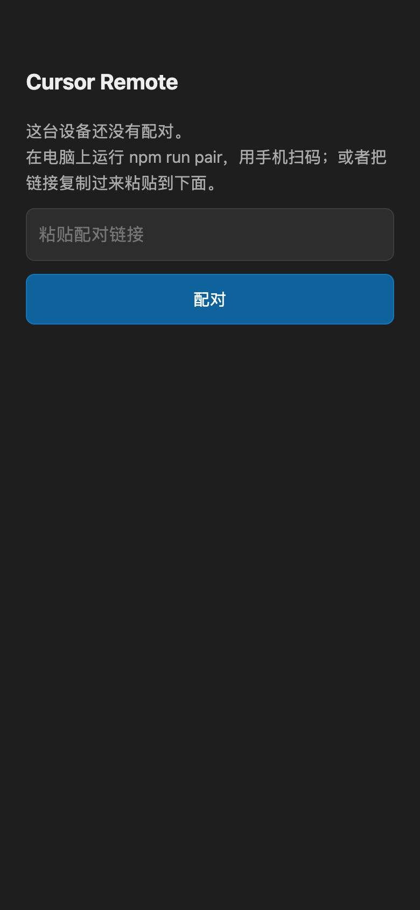

**中文** | [English](README.en.md)

# Cursor Remote Lite

**电脑不用带在身边，也能正常干活。** 电脑留在家里或公司开着，出门只带手机，就能接着用电脑上的 Cursor：给 Agent 布置任务、看它干到哪了、回答它的提问、批准命令、检查改动的文件，本地窗口和 SSH 远程窗口都行。
免费、开源、自托管，不需要服务器，也不需要手机和电脑在同一个 Wi-Fi。

> 灵感来自 [len5ky/CursorRemote](https://github.com/len5ky/CursorRemote)，这是一个从零实现的免费版本。

<p align="center"></p>

<p align="center"><sub>演示：点文件名预览 → 切到 SSH 窗口 → 调模型思考强度 → 批准运行测试 → 展开子 Agent → Agent 运行中发消息自动排队，这一轮结束后发出 → 逐个保留 / 撤销改动的文件（撤销前会确认）（演示数据）</sub></p>

## 界面

| 聊天 | 文件预览 | 切换窗口 | 选模型 |
|:-:|:-:|:-:|:-:|
|  |  |  |  |
| **模型参数** | **运行中：子 Agent + 排队** | **改动的文件** | **危险操作二次确认** |
|  |  |  |  |

## 为什么做这个

### 一个场景

早上出门前，你在电脑上让 Cursor 的 Agent 去改一个 bug，项目在公司的 GPU 服务器上（SSH 远程窗口）。然后你去通勤、开会、吃饭，或者干脆出差两天，电脑没带。

这期间 Agent 会：跑完一轮等你验收；停下来等你点「运行」；用提问的方式问你「session 过期该返回 401 还是自动续期？」。你也会想到新需求，想让它接着干。

**你需要的不是「远程看一眼」，而是电脑不在身边时也能正常干活**：布置任务、回答问题、批准命令、看改了哪些文件、决定保留还是撤销。而且干活的环境必须是你自己那台电脑：本地的代码和数据、配好的 SSH 服务器、装好的依赖，都在那里。

### 现有方案能做到什么，差在哪

- **Cursor 官方手机端**（Cursor for iOS + Remote Control）：只有 iPhone / iPad（iOS 26+），安卓还没有原生 App；需要付费套餐；Remote Control 只支持 Agents 窗口，并且 Agent 的推理循环会转到 Cursor 云端。普通编辑器窗口、SSH 远程窗口里正在进行的对话管不了。
- **[len5ky/CursorRemote](https://github.com/len5ky/CursorRemote)**：思路相同（通过调试端口控制本机 Cursor），但需要 $7.99/月的许可证，代码是 source-available 而非开源；外网访问要自己配 Tailscale 或 Telegram 机器人。
- **远程桌面**（向日葵、ToDesk、RustDesk、Chrome 远程桌面）：什么都能控制，但等于在手机上操作一块缩小的电脑屏幕，看 Cursor 的聊天面板、点小按钮、打字都非常吃力，也费流量；Agent 跑完或等你确认时也不会提醒你。

### 这个项目怎么做

电脑上跑一个很小的中继，直接操作你电脑上真实的 Cursor；手机上是一个为手机重新设计的界面：

- Agent 的对话像聊天 App 一样看，直接打字发消息，运行中发的消息自动排队。
- Agent 等你点「运行」、或者用提问的方式问你问题时，手机弹通知，点开就能回答。
- 改了哪些文件、加删了多少行，逐个保留或撤销；需要时还能切到实时画面。
- 所有窗口都能用：本地、SSH 远程、Agents 窗口；模式、模型、思考强度随时换。
- 代码和对话留在你自己的电脑上，不上传到任何云端 Agent；手机通过 Cloudflare 隧道（HTTPS）实时访问；安卓、iPhone 都能用，国内网络也能用。

### 为什么安卓和 iPhone 都要支持

官方 App 只有 iPhone，但用户的手机远不止 iPhone：

| 地区 | iOS | 安卓 | 时间 |
|---|---|---|---|
| 美国 | 60.7% | 39.3% | 2026 年 8 月 |
| 欧洲 | 39.5% | 60.4% | 2026 年 7 月 |
| 全球 | 约 28% | 约 72% | 2026 年 |
| 中国大陆 | 少数 | 多数，且华为、小米、OPPO 等很多没有谷歌服务 | — |

数据来自 [StatCounter](https://gs.statcounter.com/os-market-share/mobile/)，它统计的是约 150 万个网站的访问量里各系统的占比，反映「实际在用的手机」，不是销量。iPhone 用户上网更多，所以 iOS 的占比会略偏高；具体数字看个大概即可，结论是确定的：**美国 iPhone 略多，欧洲和全球安卓更多，国内大部分是没有谷歌服务的安卓**。

所以本项目同时提供：没有谷歌服务也能装的安卓 App，以及 iPhone 上「添加到主屏幕」的全屏应用（不用上架 App Store，欧洲也能用）。

## 和其他方案的区别

| | Cursor Remote Lite（本项目） | Cursor 官方 iOS App | len5ky/CursorRemote | 远程桌面 |
|---|---|---|---|---|
| 价格 | 免费 | 需要 Cursor 付费套餐 | $7.99/月 | 多数免费 / 付费 |
| 许可证 | MIT 开源 | 闭源 | source-available | — |
| 手机 | 安卓 App、iPhone、任意浏览器 | 仅 iPhone / iPad | 任意浏览器、Telegram | 各平台 App |
| 能控制的窗口 | 所有窗口：本地、SSH 远程、Agents | 仅 Agents 窗口（Remote Control） | 本机窗口 | 整个桌面 |
| 代码 / 对话经过哪里 | 只在你的电脑，经 Cloudflare 隧道（HTTPS）传到手机 | Agent 循环在 Cursor 云端 | 你的电脑 + 局域网 / Tailscale | 远程桌面厂商的服务器 |
| 外网访问 | 自带，免配置；地址固定 | 自带 | 需自己配 Tailscale / Telegram | 自带 |
| 手机上的体验 | 聊天界面 + 实时画面，文件预览 | 原生 App | 聊天界面 | 缩小的电脑屏幕 |
| 完成 / 等确认时提醒 | ✅ App 内通知，不用装别的软件 | ✅ | 通过 Telegram | ❌ |
| 电脑需要开着 | 需要（不能睡眠） | 云端 Agent 不需要；Remote Control 需要 | 需要 | 需要 |

**本项目的不足**，也写在这里：

- 靠读取 Cursor 的界面实现，Cursor 大改版后可能需要跟着更新。
- 后台服务和启动脚本目前只支持 macOS；Windows 需要手动启动（见下文）。
- 免费的 Cloudflare 快速隧道没有可用性保证，偶尔会断开重连。

## 功能

- **聊天模式**：像聊天 App 一样看 Agent 对话（气泡、工具调用卡片、思考过程），直接输入发送，Agent 停下来等你确认时，按钮会出现在手机上。
- **文件预览**：对话里出现的文件名（蓝色）、带 📄 的工具卡片，点一下就能全屏查看文件内容，带行号；图片直接显示。SSH 远程窗口的文件通过 `ssh` 读取（要求电脑能免密 ssh 到那台机器，用 Cursor 连 SSH 的电脑一般都已配置好）。
- **屏幕模式**：实时画面，可以只看聊天面板或整个窗口，点按 / 滚动 / 缩放 / 常用按键都会传到电脑上。
- **通知**：Agent 跑完、或停下来等你点「运行 / 允许」时，手机弹通知，点一下直接打开那个窗口。所有窗口都会提醒，正在手机上看的那个窗口不重复提醒。
- **多窗口**：点左上角窗口名切换窗口，SSH 远程窗口、Agents 窗口都能选。
- **模式 / 模型 / 历史对话**：手机上直接切 Agent / Plan / Ask，换模型，打开历史对话，新建对话。
- **模型参数**：模型列表里点「参数」可以调上下文长度（如 300K / 1M）、思考强度（Low → Max）、Fast 开关；顶部还有 MAX Mode 开关。能调哪些由 Cursor 对这个模型提供什么决定。
- **回答 Agent 的提问**：Agent 用提问的方式问你问题时（单选、多个问题、或者自己写答案），手机上会出现「Agent 在问你」卡片，点选项或写上答案再提交，也可以跳过；通知里直接显示问题内容。
- **排队消息**：Agent 正在跑时发的消息会进 Cursor 的排队列表，手机上会显示「Agent 正在运行」和排队中的每一条，可以修改、立即发送（打断当前这一轮）或删除，也可以一键停止 Agent。
- **子 Agent**：Agent 派出的子 Agent 正在跑时，手机上会显示「子 Agent 运行中 N 个」（默认收起，点开才列出），点「查看」可以看它自己的对话过程（只读），也可以单独停止它。
- **改动的文件**：Agent 改过文件后，输入框上方会出现「改动了 N 个文件 ›」，点开能看到每个文件加了 / 删了多少行，点文件名看内容，也可以逐个「保留」或「撤销」，和桌面上的 Keep / Undo 一样。
- **发图片**：输入框旁的图片按钮，选一张照片或截图（比如手机拍的报错画面），会附加到 Cursor 的输入框里，再写上文字一起发出去。大图会先在手机上压缩。
- **防误触**：停止 Agent、停止子 Agent、撤销改动、删除排队消息、拒绝、移除设备、取消配对这类不可逆的操作，都会先弹出确认。
- **语音输入（默认关闭）**：输入法键盘上的麦克风就能语音输入，所以默认不显示麦克风按钮。需要的话在「⋯ → 语音按钮」里打开：安卓 App 调用系统语音识别，iPhone / 浏览器用浏览器自带的语音识别。
- **中文 / English**：默认跟随手机系统语言，也可以在「⋯ → 语言 / Language」里切换；通知内容也会跟着变。
- **设备配对**：不用密码。电脑上生成一次性二维码，手机扫一下就配对好了；可选 Authenticator 二次验证。
- **固定地址**：App 放在你自己的 GitHub Pages 上，电脑重启、隧道地址变化都不用重新配对。

## 原理

```
手机 App (GitHub Pages) ──HTTPS/WebSocket──> Cloudflare 隧道 ──> 电脑上的中继 (Node) ──CDP──> Cursor
```

Cursor 基于 Electron，用 `--remote-debugging-port` 启动后，中继通过 Chrome DevTools Protocol 读取聊天内容、截取画面、模拟点击和键盘输入。

## 要求

- macOS（Windows / Linux 上 `server.mjs` 也能跑，但启动和后台服务脚本只支持 macOS，见下文「Windows」）
- Node.js 22+
- [cloudflared](https://developers.cloudflare.com/cloudflare-one/connections/connect-networks/downloads/)：外网访问，`brew install cloudflared`
- [GitHub CLI](https://cli.github.com/)：固定地址，`brew install gh`

## 快速上手（5 分钟）

**第 1 步：在电脑上安装**

```bash
git clone https://github.com/Suchenl/cursor-remote-lite.git
cd cursor-remote-lite
npm install
npm run setup        # 创建手机 App 仓库、设置开机自启，可选开启二次验证
./start-cursor.sh    # 让 Cursor 带调试端口重启（会先退出当前 Cursor）
```

`npm run setup` 会在**你自己的** GitHub 账号下创建一个公开仓库（默认叫 `cursor-remote-app`），用 GitHub Pages 托管手机 App 和加密过的电脑地址。每个人用自己的，和作者或其他用户都没有关系。

**第 2 步：配对手机**

```bash
npm run pair
```

终端里会出现一个二维码（10 分钟内有效，只能用一次）。用手机相机或浏览器扫码打开即可，没有密码要输。
扫不了码的话，把二维码下面的链接发到手机上打开（或者粘贴到 App 的输入框里）。

<p align="center"></p>

**第 3 步：装到手机上（可选，但推荐）**

- **iPhone**：Safari 打开后 → 分享 → 添加到主屏幕
- **Android**：下载 [CursorRemote.apk](https://github.com/Suchenl/cursor-remote-lite/releases/latest/download/CursorRemote.apk) 安装，然后用手机扫配对码，浏览器会提示「在 App 中打开」，点一下就配对进 App 了（配对码用过了就再运行一次 `npm run pair`）。
  华为等没有谷歌服务的手机也能用（浏览器的「安装应用」在这些手机上通常不可用）。
  注意：纯血鸿蒙（HarmonyOS NEXT / 5.0 及以上）不能直接装 APK，需要先装「卓易通」。

**第 4 步：开始用**

- 左上角是当前窗口，点它切换窗口（本地 / SSH / Agents）。
- 底部输入框发消息；`Agent ▾` / `Auto ▾` 切模式和模型；「历史」打开以前的对话，「＋ 新建」开新对话。
- Agent 等你确认时（运行命令、接受修改），按钮会直接出现在对话里。
- 点蓝色文件名或带 📄 的卡片预览文件，按返回键关闭。
- 右上角「画面」切到实时画面，可以直接点 Cursor 界面上的任何东西。
- 右上角「⋯ → 开启通知」，Agent 跑完或等你确认时手机会提醒（见下文「通知」）。

以后每次 Cursor 重启都要带调试端口，用 `./start-cursor.sh` 启动即可。

## 通知

在 App 里点「⋯ → 开启通知」，之后可以点「发一条测试通知」确认能收到。

| 手机 | 怎么收通知 | 需要注意 |
|---|---|---|
| 安卓 App | App 自己在后台和电脑保持连接，不依赖谷歌服务，华为也能用 | 通知栏会常驻一条「正在等待 Agent 的消息」（安卓系统的要求）。华为 / 小米等请允许后台运行：华为在「设置 → 应用和服务 → 应用启动管理」里把 Cursor Remote 改成手动管理并全部打开 |
| iPhone | 系统推送（Web Push），App 关掉也能收到 | 必须先「添加到主屏幕」并从桌面图标打开，iOS 16.4 以上 |
| 电脑 / 安卓浏览器 | 浏览器推送 | 浏览器要允许通知 |

什么时候会提醒：

- **等你确认**：Agent 停在「运行 / 允许 / 接受」按钮上超过约 10 秒（开了自动运行时一闪而过的不算）。
- **已完成**：Agent 停止运行，通知里带回复的开头。
- 你正在手机上看的那个窗口不会重复提醒。

通知内容由电脑直接发出：安卓 App 直连你的电脑；iPhone 和浏览器经过苹果 / 谷歌的推送服务器，内容是端到端加密的，推送服务器看不到。

## 让电脑一直在线（防睡眠）

中继跑在你的电脑上，**电脑一睡眠，手机就连不上了**。

| | 锁屏 | 屏幕关闭（熄屏） | 睡眠 / 合盖 |
|---|---|---|---|
| 手机还能用吗 | ✅ 能 | ✅ 能（屏幕模式改为定时截图，稍卡） | ❌ 不能 |

所以要做的只有一件事：**允许关屏幕和锁屏，但不让系统睡眠**。

### macOS

**笔记本（插着电源时不睡眠）**：系统设置 → 电池 → 选项 → 打开「使用电源适配器且显示器关闭时，防止自动进入睡眠」。
或者用命令（只影响插电状态，`-c` = charger）：

```bash
sudo pmset -c sleep 0          # 插电时永不睡眠
sudo pmset -c displaysleep 10  # 屏幕照常 10 分钟后关闭（省电，不影响使用）
pmset -g | grep -E " sleep|displaysleep"   # 查看当前设置
```

**台式机（Mac mini / iMac / Studio）**：系统设置 → 节能 → 打开「显示器关闭时，防止自动进入睡眠」。

**只想临时不睡**（比如出门前让 Agent 跑个长任务）：

```bash
caffeinate -s    # 插电时阻止睡眠，按 Ctrl+C 恢复
```

**合盖**：MacBook 合盖一定会睡眠（除非外接显示器 + 电源 + 键盘）。要远程用就别合盖，把屏幕亮度调到最低、锁屏即可。
不建议用 `sudo pmset -a disablesleep 1` 强行禁止合盖睡眠：放进包里会过热。

### Windows

设置 → 系统 → 电源和电池 → 屏幕和睡眠：「接通电源后，使设备进入睡眠状态」选 **从不**；「关闭屏幕」可以保留（比如 10 分钟）。
或者用管理员 PowerShell：

```powershell
powercfg /change standby-timeout-ac 0     # 插电时永不睡眠
powercfg /change monitor-timeout-ac 10    # 屏幕 10 分钟后关闭
powercfg /change hibernate-timeout-ac 0   # 插电时不休眠
# 笔记本合盖不睡眠（插电时）：
powercfg /setacvalueindex SCHEME_CURRENT SUB_BUTTONS LIDACTION 0
powercfg /setactive SCHEME_CURRENT
```

Windows 上的启动方式：用 `"%LOCALAPPDATA%\Programs\cursor\Cursor.exe" --remote-debugging-port=9222` 启动 Cursor，再在项目目录运行 `npm run public`（窗口不要关）。`npm run pair` 照常使用。

### 代价

- **耗电**：笔记本熄屏待机约 3–8 W，一天不到 0.2 度电；台式机 30–100 W，一天 1–2 度电。
- **电池**：笔记本长期插电满电会加速电池老化。macOS 的「优化电池充电」、Windows 厂商的「电池保护 / 充电上限 80%」可以缓解，建议打开。
- **安全**：电脑一直开着，等于一直可以被已配对的手机控制。请保持锁屏（锁屏不影响使用），不用的设备及时在「⋯ → 已配对设备」里移除。

### 不配置会怎样

- 电脑睡眠后，手机显示「电脑不在线」，什么都做不了；**Agent 正在跑的任务也会暂停**，直到有人唤醒电脑。
- 唤醒后服务会自动恢复。隧道地址会变，但会自动发布新地址，手机约 1 分钟后自动重连，**不需要重新配对**。

## 安全说明

- **配对**：`npm run pair` 生成的链接包含一个随机密钥和一次性配对码，10 分钟后失效、用过即作废。手机配对后拿到一个设备令牌，电脑上只保存它的哈希。
- **GitHub 上没有可破解的东西**：Pages 仓库里的 `url.json`（电脑地址）用随机 256 位密钥加密，这个密钥只通过配对链接传给手机，从不上传。没有密码，也就不存在离线暴力破解密码的问题。
- **二次验证（可选）**：`npm run 2fa` 绑定 Google Authenticator / Microsoft Authenticator / 1Password 等。开启后，配对新设备时必须输入 6 位验证码；还可以设置每 N 天重新验证一次（默认 30 天，填 0 表示只在配对时验证）。即使配对链接泄露，没有你的手机验证码也配不上。
- **管理设备**：手机上「⋯ → 已配对设备」可以查看和移除，或在电脑上 `npm run devices`。移除后那台设备立即断开。
- 调试端口 9222 只监听本机；公网模式下中继也只监听 `127.0.0.1`，外部只能通过隧道访问。
- 配对失败多次会临时锁定。
- 能配对的设备可以完全控制你的 Cursor，等同于能在你电脑上执行命令。**不要把配对链接发到群里或公开的地方。**

## 常用命令

| 命令 | 作用 |
|---|---|
| `npm run setup` | 安装向导（可重复运行） |
| `npm run pair` | 配对一台新设备（显示二维码） |
| `npm run devices` | 查看已配对设备；`npm run devices remove <id>` 移除 |
| `npm run 2fa` | 开启 / 重新绑定 Authenticator 二次验证；`npm run 2fa off` 关闭；`npm run 2fa status` 查看 |
| `npm run public` | 前台运行（外网 + 固定地址） |
| `npm start` | 前台运行（只在局域网） |
| `./service.sh status / logs / uninstall` | 后台服务状态 / 日志 / 卸载 |
| `npm run reset` | 清除所有配对、二次验证和配置（之后要重新配对） |

## 常见问题

**手机上显示「未连接到 Cursor」**：Cursor 没带调试端口启动，运行 `./start-cursor.sh`。

**手机上显示「电脑不在线」**：电脑睡眠 / 关机，或服务刚重启（新地址约 1 分钟后生效，会自动重试）。见上文「防睡眠」。

**换了手机 / 清了浏览器数据**：在电脑上 `npm run pair` 重新配对，旧设备在「已配对设备」里删掉。

**要花钱吗？会用掉什么免费额度吗？** 不会。运行时只用到三样东西：
- Cloudflare 快速隧道：免费，不用注册。
- GitHub Pages：公开仓库免费。电脑每次重启发布一次地址（一次提交）；Pages 建议每小时不超过 10 次构建，超过也只是稍晚生效。
- GitHub API：每小时 5000 次额度，实际只用几次。

GitHub Actions 只在作者发布新版 APK 时用到，用户这边不会运行。

**收不到通知**：先在菜单里「发一条测试通知」。测试通知收不到：安卓检查系统通知权限和后台运行权限；iPhone 确认是从桌面图标打开的。测试通知能收到、但 Agent 的提醒没来：电脑可能睡眠了，或者 Cursor 不是用 `./start-cursor.sh` 启动的。

**公司网络打不开**：Cloudflare 隧道走 443 端口，一般都能用；如果连 `trycloudflare.com` 都被拦，就只能在同一局域网下用 `npm start`。

**SSH 远程窗口看不到**：点左上角窗口名打开窗口列表，列表每次打开都会刷新。

**点文件提示找不到**：文件可能已被删除或移动；SSH 窗口的文件需要电脑能免密 `ssh` 到那台机器。

## 赞赏

觉得好用的话，可以请作者喝杯咖啡 ☕（完全自愿）

| 微信 | 支付宝 |
|---|---|
|  |  |

App 里「⋯ → 赞赏作者」显示的内容由 `app/donate.json` 控制，可以在 `links` 里加海外付款链接，例如：

```json
"links": [{ "label": "PayPal", "url": "https://paypal.me/你的用户名" }]
```

## License

MIT
